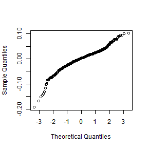

---
title: "Cond vs Nest Size Stepwise model regression"
author: "Ruth Sharpe"
date: "Run on 18 August, 2017 at 2017-08-18 13:47:41"
geometry: margin=1cm
header-includes:
    - \usepackage{float}
---


Model Reduction
=====================


[1] "number of terms"
[1] 5
[1] "pvalue"
[1] 1
\begin{table}[H]
\centering
\begin{tabular}{rrrrrrl}
  \hline
 & Sum Sq & Mean Sq & NumDF & DenDF & F.value & p\_value \\ 
  \hline
logCtFm & 0.03 & 0.03 &   1 & 437.76 & 2.33 & 0.128  \\ 
  InstarNumber & 0.02 & 0.02 &   1 & 1202.85 & 2.31 & 0.129  \\ 
  I(logCtFm\verb|^|2) & 0.03 & 0.03 &   1 & 394.10 & 2.39 & 0.123  \\ 
  InstarNumber:InstarSex & 0.01 & 0.01 &   1 & 1256.26 & 0.90 & 0.342  \\ 
  logCtFm:InstarNumber & 0.03 & 0.03 &   1 & 1221.90 & 2.65 & 0.104  \\ 
  InstarNumber:I(logCtFm\verb|^|2) & 0.03 & 0.03 &   1 & 1235.97 & 2.46 & 0.117  \\ 
  logCtFm:InstarNumber:InstarSex & 0.01 & 0.01 &   1 & 1255.59 & 0.63 & 0.427  \\ 
  InstarNumber:InstarSex:I(logCtFm\verb|^|2) & 0.00 & 0.00 &   1 & 1254.97 & 0.38 & 0.535 RMVD \\ 
   \hline
\end{tabular}
\end{table}
[1] "term with highest p value is: InstarNumber:InstarSex:I(logCtFm^2)"
[1] "number of terms"
[1] 8
[1] "pvalue"
[1] 0.5350013
\begin{table}[H]
\centering
\begin{tabular}{rrrrrrl}
  \hline
 & Sum Sq & Mean Sq & NumDF & DenDF & F.value & p\_value \\ 
  \hline
logCtFm & 0.03 & 0.03 &   1 & 435.07 & 2.41 & 0.121  \\ 
  InstarNumber & 0.03 & 0.03 &   1 & 1170.80 & 3.15 & 0.076. \\ 
  I(logCtFm\verb|^|2) & 0.03 & 0.03 &   1 & 391.94 & 2.47 & 0.117  \\ 
  InstarNumber:InstarSex & 0.02 & 0.02 &   1 & 1255.21 & 1.81 & 0.179 RMVD \\ 
  logCtFm:InstarNumber & 0.04 & 0.04 &   1 & 1196.47 & 3.56 & 0.059. \\ 
  InstarNumber:I(logCtFm\verb|^|2) & 0.04 & 0.04 &   1 & 1216.41 & 3.33 & 0.068. \\ 
  logCtFm:InstarNumber:InstarSex & 0.02 & 0.02 &   1 & 1254.22 & 2.16 & 0.142  \\ 
   \hline
\end{tabular}
\end{table}
[1] "term with highest p value is: InstarNumber:InstarSex"
[1] "number of terms"
[1] 7
[1] "pvalue"
[1] 0.1786378
\begin{table}[H]
\centering
\begin{tabular}{rrrrrrl}
  \hline
 & Sum Sq & Mean Sq & NumDF & DenDF & F.value & p\_value \\ 
  \hline
logCtFm & 0.03 & 0.03 &   1 & 434.37 & 2.52 & 0.113  \\ 
  InstarNumber & 0.04 & 0.04 &   1 & 1163.55 & 3.71 & 0.054. \\ 
  I(logCtFm\verb|^|2) & 0.03 & 0.03 &   1 & 391.59 & 2.56 & 0.110  \\ 
  logCtFm:InstarNumber & 0.04 & 0.04 &   1 & 1193.32 & 3.91 & 0.048* \\ 
  InstarNumber:I(logCtFm\verb|^|2) & 0.04 & 0.04 &   1 & 1215.21 & 3.49 & 0.062. \\ 
  logCtFm:InstarNumber:InstarSex & 0.01 & 0.01 &   1 & 1252.45 & 0.50 & 0.479 RMVD \\ 
   \hline
\end{tabular}
\end{table}
[1] "term with highest p value is: logCtFm:InstarNumber:InstarSex"
[1] "number of terms"
[1] 6
[1] "pvalue"
[1] 0.4789467
\begin{table}[H]
\centering
\begin{tabular}{rrrrrrl}
  \hline
 & Sum Sq & Mean Sq & NumDF & DenDF & F.value & p\_value \\ 
  \hline
logCtFm & 0.03 & 0.03 &   1 & 434.34 & 2.51 & 0.114 RMVD \\ 
  InstarNumber & 0.04 & 0.04 &   1 & 1163.59 & 3.69 & 0.055. \\ 
  I(logCtFm\verb|^|2) & 0.03 & 0.03 &   1 & 391.56 & 2.55 & 0.111  \\ 
  logCtFm:InstarNumber & 0.04 & 0.04 &   1 & 1193.37 & 3.91 & 0.048* \\ 
  InstarNumber:I(logCtFm\verb|^|2) & 0.04 & 0.04 &   1 & 1215.25 & 3.47 & 0.063. \\ 
   \hline
\end{tabular}
\end{table}
[1] "i = 1"
[1] "term with highest p value is: I(logCtFm^2)"
[1] "number of terms"
[1] 5
[1] "pvalue"
[1] 0.1109188
\begin{table}[H]
\centering
\begin{tabular}{rrrrrrl}
  \hline
 & Sum Sq & Mean Sq & NumDF & DenDF & F.value & p\_value \\ 
  \hline
logCtFm & 0.00 & 0.00 &   1 & 205.88 & 0.00 & 0.983 RMVD \\ 
  InstarNumber & 0.01 & 0.01 &   1 & 50.67 & 1.21 & 0.276  \\ 
  logCtFm:InstarNumber & 0.02 & 0.02 &   1 & 34.44 & 1.61 & 0.214  \\ 
  InstarNumber:I(logCtFm\verb|^|2) & 0.01 & 0.01 &   1 & 33.75 & 1.00 & 0.325  \\ 
   \hline
\end{tabular}
\end{table}
[1] "i = 1"
[1] "term with highest p value is: InstarNumber:I(logCtFm^2)"
[1] "number of terms"
[1] 4
[1] "pvalue"
[1] 0.3251061
\begin{table}[H]
\centering
\begin{tabular}{rrrrrrl}
  \hline
 & Sum Sq & Mean Sq & NumDF & DenDF & F.value & p\_value \\ 
  \hline
logCtFm & 0.00 & 0.00 &   1 & 262.60 & 0.02 & 0.892 RMVD \\ 
  InstarNumber & 0.00 & 0.00 &   1 & 1238.86 & 0.24 & 0.622  \\ 
  logCtFm:InstarNumber & 0.01 & 0.01 &   1 & 1251.75 & 1.21 & 0.272  \\ 
   \hline
\end{tabular}
\end{table}
[1] "i = 1"
[1] "i = 2"
[1] "term with highest p value is: logCtFm:InstarNumber"

Final Model is:  condResiduals ~ logCtFm + InstarNumber + 1 | NestID\begin{table}[H]
\centering
\begin{tabular}{lrrrrrr}
  \hline
 & Sum Sq & Mean Sq & NumDF & DenDF & F.value & Pr($>$F) \\ 
  \hline
logCtFm & 0.06 & 0.06 & 1.00 & 21.42 & 5.13 & 0.0340 \\ 
  InstarNumber & 0.06 & 0.06 & 1.00 & 1265.29 & 5.83 & 0.0159 \\ 
   \hline
\end{tabular}
\end{table}

\pagebreak

Checking full model fit
--------------------


```
Condition=log(ColonySize) + InstarAge + InstarAge:InstarSex + log(ColonySize):InstarAge + log(ColonySize):InstarAge:InstarSex + Ilog(ColonySize)2 + Ilog(ColonySize)2:InstarAge + Ilog(ColonySize)2:InstarAge:InstarSex + (1|Colony)-InstarAge:InstarSex:Ilog(ColonySize)2-InstarAge:InstarSex-log(ColonySize):InstarAge:InstarSex-Ilog(ColonySize)2-InstarAge:Ilog(ColonySize)2-log(ColonySize):InstarAge
```


\pagebreak


Graph with full model superimposed
====================
 


```
Model:
condResiduals ~ logCtFm + InstarNumber + InstarNumber:InstarSex + logCtFm:InstarNumber + logCtFm:InstarNumber:InstarSex + I(logCtFm^2) + I(logCtFm^2):InstarNumber + I(logCtFm^2):InstarNumber:InstarSex + (1 | NestID) - InstarNumber:InstarSex:I(logCtFm^2) - InstarNumber:InstarSex - logCtFm:InstarNumber:InstarSex - I(logCtFm^2) - InstarNumber:I(logCtFm^2) - logCtFm:InstarNumber
```

```
Note: If line on graph is blue R could not plot the lmer, plotting a simple lm instead[1] "lmer"
```


