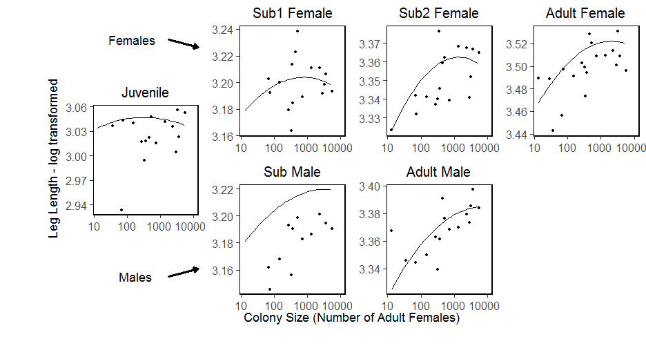

---
title: "Cond vs Nest Size Stepwise model regression"
author: "Ruth Sharpe"
date: "Run on 23 August, 2017 at 2017-08-23 17:31:15"
geometry: margin=1cm
header-includes:
    - \usepackage{float}
---


Model Reduction
=====================


[1] "number of terms"
[1] 5
[1] "pvalue"
[1] 1
\begin{table}[H]
\centering
\begin{tabular}{rrrrrrl}
  \hline
 & Sum Sq & Mean Sq & NumDF & DenDF & F.value & p\_value \\ 
  \hline
logCtFm & 0.00 & 0.00 &   1 & 30.83 & 0.07 & 0.788  \\ 
  InstarNumber & 0.00 & 0.00 &   1 & 1265.35 & 0.00 & 0.958 RMVD \\ 
  I(logCtFm\verb|^|2) & 0.00 & 0.00 &   1 & 23.40 & 0.05 & 0.819  \\ 
  InstarNumber:InstarSex & 0.02 & 0.02 &   1 & 1255.44 & 1.97 & 0.161  \\ 
  logCtFm:InstarNumber & 0.00 & 0.00 &   1 & 1266.84 & 0.37 & 0.545  \\ 
  logCtFm:InstarNumber:InstarSex & 0.02 & 0.02 &   1 & 1254.44 & 2.32 & 0.128  \\ 
   \hline
\end{tabular}
\end{table}
[1] "i = 1"
[1] "term with highest p value is: I(logCtFm^2)"
[1] "number of terms"
[1] 6
[1] "pvalue"
[1] 0.8190608
\begin{table}[H]
\centering
\begin{tabular}{rrrrrrl}
  \hline
 & Sum Sq & Mean Sq & NumDF & DenDF & F.value & p\_value \\ 
  \hline
logCtFm & 0.00 & 0.00 &   1 & 263.83 & 0.03 & 0.862  \\ 
  InstarNumber & 0.00 & 0.00 &   1 & 1252.59 & 0.01 & 0.938 RMVD \\ 
  InstarNumber:InstarSex & 0.02 & 0.02 &   1 & 1256.03 & 1.98 & 0.160  \\ 
  logCtFm:InstarNumber & 0.00 & 0.00 &   1 & 1259.96 & 0.40 & 0.528  \\ 
  logCtFm:InstarNumber:InstarSex & 0.03 & 0.03 &   1 & 1254.91 & 2.33 & 0.127  \\ 
   \hline
\end{tabular}
\end{table}
[1] "i = 1"
[1] "i = 2"
[1] "term with highest p value is: InstarNumber:InstarSex"
[1] "number of terms"
[1] 5
[1] "pvalue"
[1] 0.1596441
\begin{table}[H]
\centering
\begin{tabular}{rrrrrrl}
  \hline
 & Sum Sq & Mean Sq & NumDF & DenDF & F.value & p\_value \\ 
  \hline
logCtFm & 0.00 & 0.00 &   1 & 262.63 & 0.02 & 0.894 RMVD \\ 
  InstarNumber & 0.00 & 0.00 &   1 & 1238.96 & 0.25 & 0.617  \\ 
  logCtFm:InstarNumber & 0.01 & 0.01 &   1 & 1251.53 & 1.13 & 0.288  \\ 
  logCtFm:InstarNumber:InstarSex & 0.01 & 0.01 &   1 & 1252.31 & 0.48 & 0.488  \\ 
   \hline
\end{tabular}
\end{table}
[1] "i = 1"
[1] "i = 2"
[1] "term with highest p value is: logCtFm:InstarNumber:InstarSex"
[1] "number of terms"
[1] 4
[1] "pvalue"
[1] 0.4882743
\begin{table}[H]
\centering
\begin{tabular}{rrrrrrl}
  \hline
 & Sum Sq & Mean Sq & NumDF & DenDF & F.value & p\_value \\ 
  \hline
logCtFm & 0.00 & 0.00 &   1 & 262.60 & 0.02 & 0.892 RMVD \\ 
  InstarNumber & 0.00 & 0.00 &   1 & 1238.86 & 0.24 & 0.622  \\ 
  logCtFm:InstarNumber & 0.01 & 0.01 &   1 & 1251.75 & 1.21 & 0.272  \\ 
   \hline
\end{tabular}
\end{table}
[1] "i = 1"
[1] "i = 2"
[1] "term with highest p value is: logCtFm:InstarNumber"

Final Model is:  condResiduals ~ logCtFm + InstarNumber + 1 | NestID\begin{table}[H]
\centering
\begin{tabular}{lrrrrrr}
  \hline
 & Sum Sq & Mean Sq & NumDF & DenDF & F.value & Pr($>$F) \\ 
  \hline
logCtFm & 0.06 & 0.06 & 1.00 & 21.42 & 5.13 & 0.0340 \\ 
  InstarNumber & 0.06 & 0.06 & 1.00 & 1265.29 & 5.83 & 0.0159 \\ 
   \hline
\end{tabular}
\end{table}

\pagebreak

Checking full model fit
--------------------


```
Condition=log(ColonySize) + InstarAge + InstarAge:InstarSex + log(ColonySize):InstarAge + log(ColonySize):InstarAge:InstarSex + Ilog(ColonySize)2 + (1|Colony)-Ilog(ColonySize)2-InstarAge:InstarSex-log(ColonySize):InstarAge:InstarSex-log(ColonySize):InstarAge
```


\pagebreak


Graph with full model superimposed
====================
 


```
Model:
condResiduals ~ logCtFm + InstarNumber + InstarNumber:InstarSex + logCtFm:InstarNumber + logCtFm:InstarNumber:InstarSex + I(logCtFm^2) + (1 | NestID) - I(logCtFm^2) - InstarNumber:InstarSex - logCtFm:InstarNumber:InstarSex - logCtFm:InstarNumber
```

```
Note: If line on graph is blue R could not plot the lmer, plotting a simple lm instead[1] "lmer"
```

```
Warning: Removed 1 rows containing missing values (geom_point).

Warning: Removed 1 rows containing missing values (geom_point).

Warning: Removed 1 rows containing missing values (geom_point).
```



