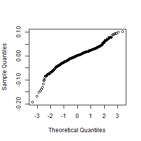
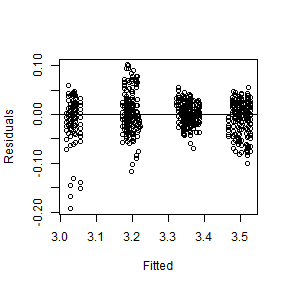
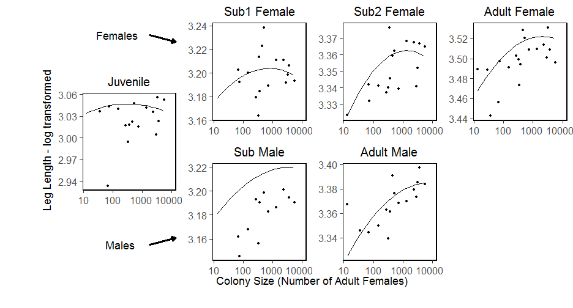

---
title: "Leg Length vs Nest Size Stepwise model regression"
author: "Ruth Sharpe"
date: "Run on 18 August, 2017 at 2017-08-18 13:48:19"
geometry: margin=1cm
header-includes:
    - \usepackage{float}
---


Model Reduction
=====================


[1] "number of terms"
[1] 5
[1] "pvalue"
[1] 1
\begin{table}[H]
\centering
\begin{tabular}{rrrrrrl}
  \hline
 & Sum Sq & Mean Sq & NumDF & DenDF & F.value & p\_value \\ 
  \hline
logCtFm & 0.02 & 0.02 &   1 & 372.40 & 25.41 & 0.000*** \\ 
  InstarNumber & 0.03 & 0.03 &   1 & 1219.39 & 31.40 & 0.000*** \\ 
  I(logCtFm\verb|^|2) & 0.02 & 0.02 &   1 & 327.57 & 22.31 & 0.000*** \\ 
  InstarNumber:InstarSex & 0.00 & 0.00 &   1 & 1257.01 & 0.40 & 0.528  \\ 
  logCtFm:InstarNumber & 0.02 & 0.02 &   1 & 1235.49 & 28.06 & 0.000*** \\ 
  InstarNumber:I(logCtFm\verb|^|2) & 0.02 & 0.02 &   1 & 1247.15 & 22.33 & 0.000*** \\ 
  logCtFm:InstarNumber:InstarSex & 0.00 & 0.00 &   1 & 1256.34 & 0.38 & 0.538 RMVD \\ 
  InstarNumber:InstarSex:I(logCtFm\verb|^|2) & 0.00 & 0.00 &   1 & 1255.73 & 0.75 & 0.386  \\ 
   \hline
\end{tabular}
\end{table}
[1] "term with highest p value is: logCtFm:InstarNumber:InstarSex"
[1] "number of terms"
[1] 8
[1] "pvalue"
[1] 0.5376304
\begin{table}[H]
\centering
\begin{tabular}{rrrrrrl}
  \hline
 & Sum Sq & Mean Sq & NumDF & DenDF & F.value & p\_value \\ 
  \hline
logCtFm & 0.02 & 0.02 &   1 & 371.47 & 25.73 & 0.000*** \\ 
  InstarNumber & 0.03 & 0.03 &   1 & 1188.17 & 32.25 & 0.000*** \\ 
  I(logCtFm\verb|^|2) & 0.02 & 0.02 &   1 & 327.23 & 22.59 & 0.000*** \\ 
  InstarNumber:InstarSex & 0.00 & 0.00 &   1 & 1256.04 & 0.02 & 0.882 RMVD \\ 
  logCtFm:InstarNumber & 0.03 & 0.03 &   1 & 1211.75 & 32.80 & 0.000*** \\ 
  InstarNumber:I(logCtFm\verb|^|2) & 0.02 & 0.02 &   1 & 1229.63 & 26.19 & 0.000*** \\ 
  InstarNumber:InstarSex:I(logCtFm\verb|^|2) & 0.00 & 0.00 &   1 & 1254.44 & 4.42 & 0.036* \\ 
   \hline
\end{tabular}
\end{table}
[1] "term with highest p value is: InstarNumber:InstarSex"
[1] "number of terms"
[1] 7
[1] "pvalue"
[1] 0.8823176
\begin{table}[H]
\centering
\begin{tabular}{rrrrrrl}
  \hline
 & Sum Sq & Mean Sq & NumDF & DenDF & F.value & p\_value \\ 
  \hline
logCtFm & 0.02 & 0.02 &   1 & 371.26 & 25.77 & 0.000*** \\ 
  InstarNumber & 0.03 & 0.03 &   1 & 1184.99 & 32.30 & 0.000*** \\ 
  I(logCtFm\verb|^|2) & 0.02 & 0.02 &   1 & 327.19 & 22.61 & 0.000*** \\ 
  logCtFm:InstarNumber & 0.03 & 0.03 &   1 & 1210.87 & 32.88 & 0.000*** \\ 
  InstarNumber:I(logCtFm\verb|^|2) & 0.02 & 0.02 &   1 & 1229.57 & 26.18 & 0.000*** \\ 
  InstarNumber:InstarSex:I(logCtFm\verb|^|2) & 0.03 & 0.03 &   1 & 1252.57 & 32.12 & 0.000*** \\ 
   \hline
\end{tabular}
\end{table}
[1] "term with highest p value is: I(logCtFm^2)"

Final Model is:  logLeg ~ 1 | NestID + logCtFm * InstarNumber + InstarNumber:I(logCtFm^2) + InstarNumber:InstarSex:I(logCtFm^2)\begin{table}[H]
\centering
\begin{tabular}{lrrrrrr}
  \hline
 & Sum Sq & Mean Sq & NumDF & DenDF & F.value & Pr($>$F) \\ 
  \hline
logCtFm & 0.01 & 0.01 & 1.00 & 126.97 & 8.61 & 0.0040 \\ 
  InstarNumber & 0.42 & 0.42 & 1.00 & 31.09 & 459.34 & 0.0000 \\ 
  logCtFm:InstarNumber & 0.01 & 0.01 & 1.00 & 21.28 & 10.84 & 0.0034 \\ 
  InstarNumber:I(logCtFm\verb|^|2) & 0.00 & 0.00 & 1.00 & 20.92 & 3.42 & 0.0786 \\ 
  InstarNumber:InstarSex:I(logCtFm\verb|^|2) & 0.03 & 0.03 & 1.00 & 1244.24 & 31.65 & 0.0000 \\ 
   \hline
\end{tabular}
\end{table}

\pagebreak

Checking full model fit
--------------------


```
log(LegLength)=log(ColonySize) + InstarAge + InstarAge:InstarSex + log(ColonySize):InstarAge + log(ColonySize):InstarAge:InstarSex + Ilog(ColonySize)2 + Ilog(ColonySize)2:InstarAge + Ilog(ColonySize)2:InstarAge:InstarSex + (1|Colony)-log(ColonySize):InstarAge:InstarSex-InstarAge:InstarSex-Ilog(ColonySize)2
```


\pagebreak


Graph with full model superimposed
====================
 


```
Model:
logLeg ~ logCtFm + InstarNumber + InstarNumber:InstarSex + logCtFm:InstarNumber + logCtFm:InstarNumber:InstarSex + I(logCtFm^2) + I(logCtFm^2):InstarNumber + I(logCtFm^2):InstarNumber:InstarSex + (1 | NestID) - logCtFm:InstarNumber:InstarSex - InstarNumber:InstarSex - I(logCtFm^2)
```

```
Note: If line on graph is blue R could not plot the lmer, plotting a simple lm instead[1] "lmer"
```



