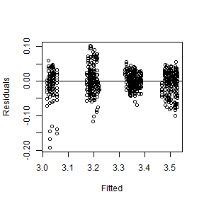

---
title: "Leg Length vs Nest Size Up Step model addition"
author: "Ruth Sharpe"
date: "Run on 23 August, 2017 at 2017-08-23 17:17:49"
geometry: margin=1cm
header-includes:
    - \usepackage{float}
---


Model Addition
=====================


+ logCtFm + InstarNumber (1 | NestID) 
 vs 
 + logCtFm + InstarNumber + (1 | NestID) logCtFm:InstarNumber
 SIGNIFICANT 
\begin{table}[H]
\centering
\begin{tabular}{rrrrrrrrrl}
  \hline
 & Df & AIC & BIC & logLik & deviance & Chisq & Chi Df & Pr($>$Chisq) & stars \\ 
  \hline
object & 5.00 & -5182.01 & -5156.28 & 2596.01 & -5192.01 &  &  &  &  \\ 
  ..1 & 6.00 & -5203.19 & -5172.31 & 2607.59 & -5215.19 & 23.17 & 1.00 & 0.00 & *** \\ 
   \hline
\end{tabular}
\end{table}
+ logCtFm + InstarNumber + (1 | NestID) logCtFm:InstarNumber 
 vs 
 + logCtFm + InstarNumber + (1 | NestID) + logCtFm:InstarNumber InstarNumber:InstarSex
 SIGNIFICANT 
\begin{table}[H]
\centering
\begin{tabular}{rrrrrrrrrl}
  \hline
 & Df & AIC & BIC & logLik & deviance & Chisq & Chi Df & Pr($>$Chisq) & stars \\ 
  \hline
object & 6.00 & -5203.19 & -5172.31 & 2607.59 & -5215.19 &  &  &  &  \\ 
  ..1 & 7.00 & -5228.53 & -5192.51 & 2621.27 & -5242.53 & 27.35 & 1.00 & 0.00 & *** \\ 
   \hline
\end{tabular}
\end{table}
+ logCtFm + InstarNumber + (1 | NestID) + logCtFm:InstarNumber InstarNumber:InstarSex 
 vs 
 + logCtFm + InstarNumber + (1 | NestID) + logCtFm:InstarNumber + InstarNumber:InstarSex logCtFm:InstarNumber:InstarSex
 *****************NOT SIGNIFICANT --- STOP HERE ************** 
\begin{table}[H]
\centering
\begin{tabular}{rrrrrrrrrl}
  \hline
 & Df & AIC & BIC & logLik & deviance & Chisq & Chi Df & Pr($>$Chisq) & stars \\ 
  \hline
object & 7.00 & -5228.53 & -5192.51 & 2621.27 & -5242.53 &  &  &  &  \\ 
  ..1 & 8.00 & -5229.98 & -5188.81 & 2622.99 & -5245.98 & 3.45 & 1.00 & 0.06 & . \\ 
   \hline
\end{tabular}
\end{table}
+ logCtFm + InstarNumber + (1 | NestID) + logCtFm:InstarNumber + InstarNumber:InstarSex logCtFm:InstarNumber:InstarSex 
 vs 
 + logCtFm + InstarNumber + (1 | NestID) + logCtFm:InstarNumber + InstarNumber:InstarSex + logCtFm:InstarNumber:InstarSex I(logCtFm^2)
 *****************NOT SIGNIFICANT --- STOP HERE ************** 
\begin{table}[H]
\centering
\begin{tabular}{rrrrrrrrrl}
  \hline
 & Df & AIC & BIC & logLik & deviance & Chisq & Chi Df & Pr($>$Chisq) & stars \\ 
  \hline
object & 8.00 & -5229.98 & -5188.81 & 2622.99 & -5245.98 &  &  &  &  \\ 
  ..1 & 9.00 & -5228.00 & -5181.68 & 2623.00 & -5246.00 & 0.02 & 1.00 & 0.89 &   \\ 
   \hline
\end{tabular}
\end{table}
Final model is  logLeg ~ logCtFm + InstarNumber + logCtFm:InstarNumber + InstarNumber:InstarSex + (1 | NestID)

\pagebreak


Checking full model fit
--------------------


```
log(LegLength)=log(ColonySize) + InstarAge + log(ColonySize):InstarAge + InstarAge:InstarSex + (1|Colony)
```




Graph with full model superimposed
====================
 


```
Model:
logLeg ~ logCtFm + InstarNumber + logCtFm:InstarNumber + InstarNumber:InstarSex + (1 | NestID)
```

```
Note: If line on graph is blue R could not plot the lmer, plotting a simple lm instead[1] "lmer"
```


